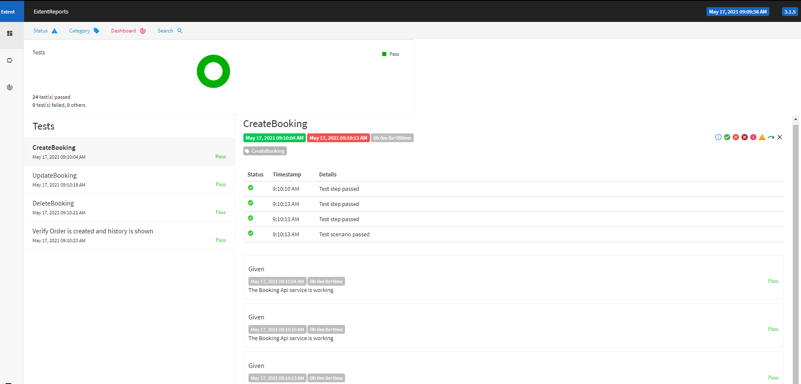

# CodingChallenge
Web & API Automation Project -
*** Features of the Framework: ***
Use of Selenium Webdriver for Web UI Automation
Use of REST-assured for API Automation
Use of Page Object Model as Design pattern
Use of ucumber as BDD Framework
Extent Reporting using Extent reports
Logging to capture the test execution workflow
Configurable parameters i.e. ability to choose different browsers and test environments
Automatic Selenium WebDriver binaries management using WebDriverManager
*** How to Run ***
Using IDE like Intellij:
Import the project in IDE
Right click pom.xml and click Run As , Maven >>Generate sources. After dependencies are downloaded.
Right click again,pom.xml and Run As, Maven >>Test. If it asks to specify the goal, choose as 'verify'
Another option is to go to the root of the folder and run maven from command line using: mvn clean compile and then 
followed by
mvn clean verify
or
mvn clean verify -Dtest=com.qa.test.TestRunners.TestRunner.java
*** Report to check ***
This framework generates multiple reports, however the best report to check is:project folder /test-results/html-report.html
It gives details like: Passed, Failed, Skipped, Pending, Total etc. along with graphs.
